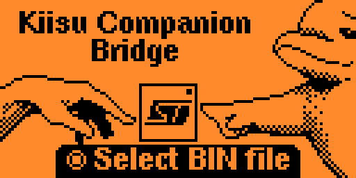

## Kiisu Companion Bridge

# Flash your Kiisu safely and with ease. No need for soldering and a lot of checksum checks.

### WARNING
The risk of a failed flash bricking your Kiisu is very low, but never zero.
Recovery is always possible via USB DFU or ST‑LINK, but may require soldering or a special adapter.

### Requirements
- Kiisu hardware with a compatible aux updater listening at I2C 0x30
- USB power plugged in (device must be charging)
- Firmware size ≤ ~48 KiB

### How to use
1. On the Flipper: Tools → Kiisu Companion Bridge
2. Plug USB power if not already; press OK to select the .bin on SD
3. Read the warning, wait the short countdown, then confirm
4. Flashing takes about 1–2 minutes. When the green LED blinks, unplug and re-plug power

### Troubleshooting
- Device not found (0x30): check if your current firmware is not too old
- Bad vector table: build image for base 0x08000000 or staged 0x08010000
- Commit timeout or CRC mismatch: ensure stable power and I2C lines; retry
- Finalize failed: try again; if persistent, flash with USB or ST-LINK to recover
- Flashing takes longer than 5 minutes: unplug and replug battery and try to boot. If it does not boot, recover with USB or ST-LINK